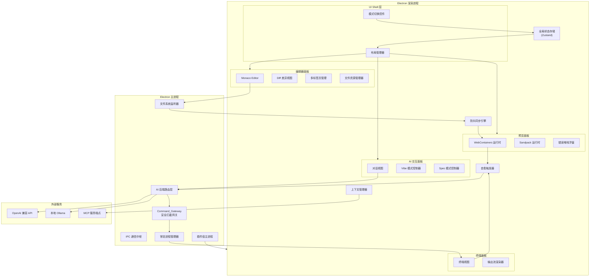
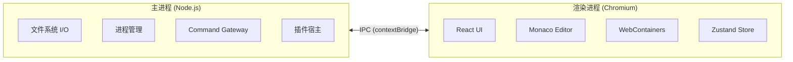
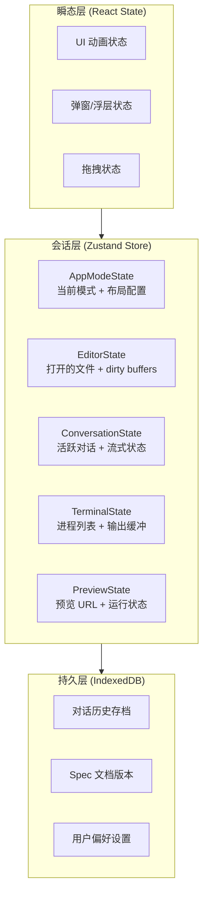
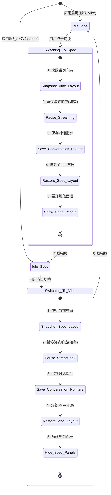
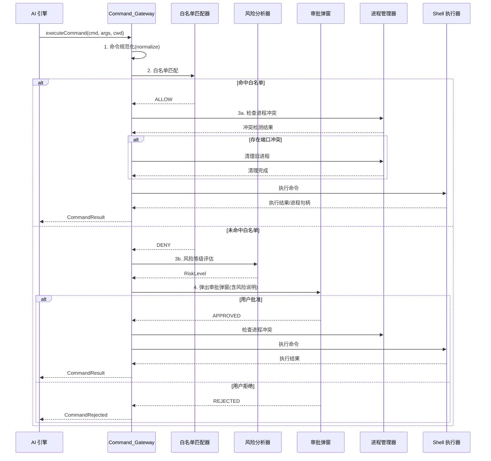
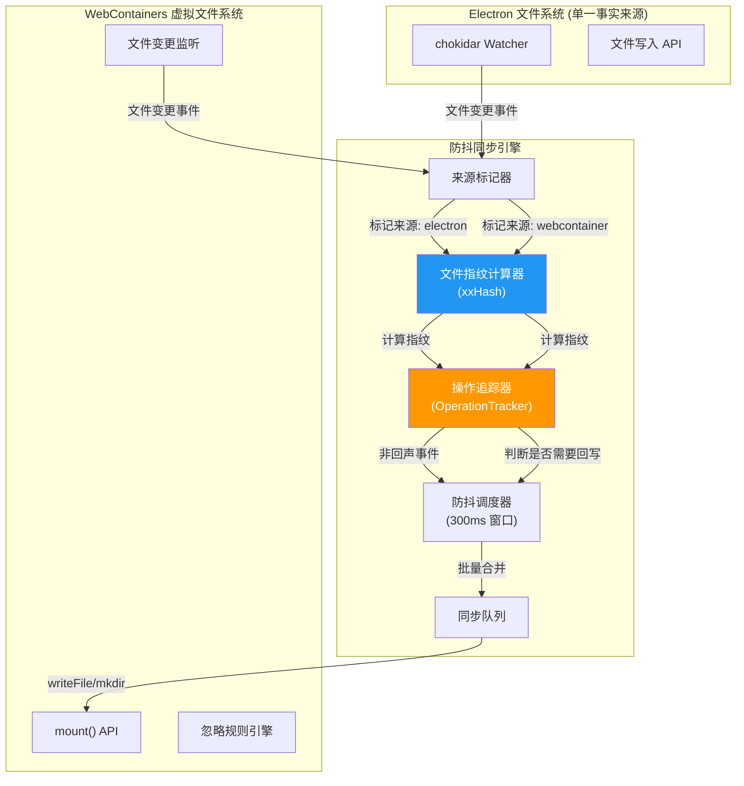
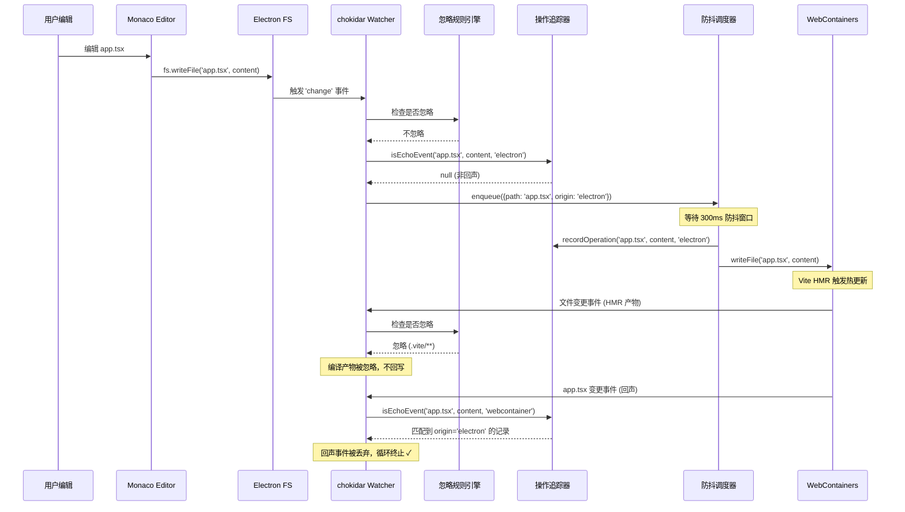
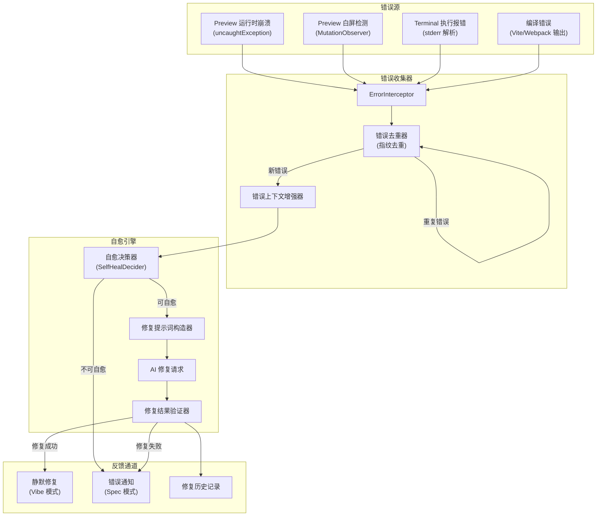
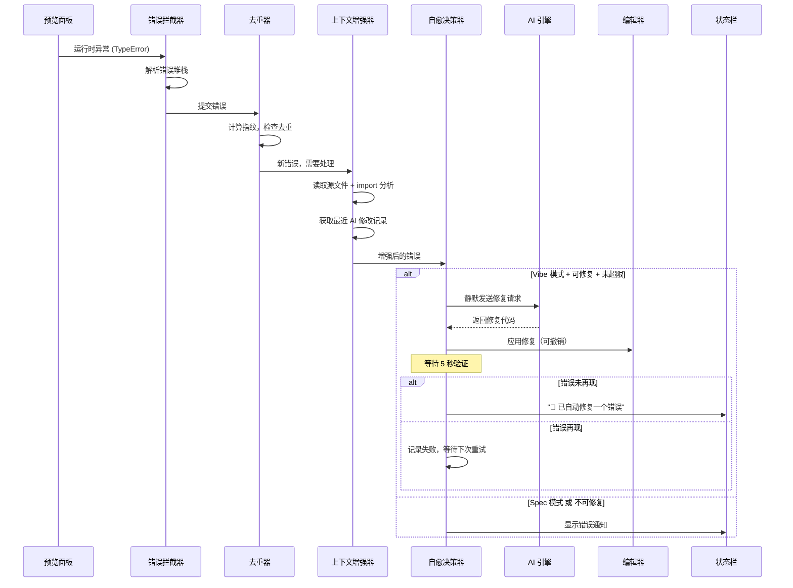
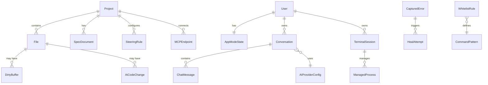

# 设计文档：Fule AI 原生 IDE

## 概述

Fule 是一款基于 Electron 的开源 AI 原生集成开发环境，核心设计理念是"所见即所得的 AI 编程"。系统采用微内核架构，以 Monaco Editor 为编辑核心，内嵌 WebContainers/Sandpack 实时预览，支持 Vibe Coding（极简对话式编程）和 Spec（规范驱动开发）双模式无缝切换。

本设计文档覆盖全部 12 项需求，并对以下 4 个核心模块进行深度设计：
1. **双模式切换的状态管理逻辑** — 无损保留对话历史、代码状态与终端运行状态
2. **Command_Gateway 安全拦截算法与白名单过滤机制** — 命令拦截网关的详细设计
3. **Electron 与 WebContainers 之间的防抖同步架构** — 文件指纹识别与同步死循环防护
4. **AI 隐式自愈触发链路设计** — 错误自动捕获与静默修复闭环

## 架构

### 整体系统架构



### 进程架构



系统严格遵循 Electron 安全最佳实践：渲染进程通过 `contextBridge` 暴露的预定义 API 与主进程通信，禁止直接访问 Node.js API。


## 组件与接口

### 模块一：双模式切换的状态管理逻辑（深度设计）

> 对应需求 1、需求 2、需求 3

#### 设计目标

在 Vibe_Coding_Mode 和 Spec_Mode 之间切换时，**零丢失**地保留以下三类状态：
1. **代码状态** — 所有未保存的编辑缓冲区（dirty buffers）、光标位置、撤销栈
2. **AI 对话历史** — 完整的多轮对话消息链、当前流式响应状态
3. **终端运行状态** — 所有活跃进程的 PID、输出缓冲区、端口占用信息

#### 状态分层架构



#### 核心状态模型

```typescript
// ===== 模式状态 =====
type AppMode = 'vibe' | 'spec';

interface AppModeState {
  currentMode: AppMode;
  // 每个模式独立保存布局快照
  layoutSnapshots: Record<AppMode, LayoutSnapshot>;
  // 切换锁，防止切换过程中的并发操作
  isSwitching: boolean;
}

interface LayoutSnapshot {
  editorWidth: number;       // 编辑器宽度比例
  previewWidth: number;      // 预览面板宽度比例
  previewVisible: boolean;   // 预览面板是否可见
  terminalHeight: number;    // 终端面板高度
  terminalVisible: boolean;  // 终端面板是否可见
  sidebarWidth: number;      // 侧边栏宽度
  // Spec 模式特有
  specPanelVisible?: boolean;
  specPanelWidth?: number;
}

// ===== 编辑器状态 =====
interface EditorState {
  openTabs: TabInfo[];
  activeTabId: string | null;
  dirtyBuffers: Map<string, DirtyBuffer>;  // filePath -> buffer
}

interface DirtyBuffer {
  originalContent: string;   // 磁盘上的原始内容
  currentContent: string;    // 当前编辑内容
  undoStack: EditOperation[]; // Monaco 撤销栈快照
  cursorPosition: CursorPosition;
  scrollPosition: ScrollPosition;
  // AI 变更相关
  pendingAiDiff?: AiDiffInfo;
}

interface AiDiffInfo {
  originalContent: string;
  modifiedContent: string;
  status: 'pending' | 'accepted' | 'reverted';
  conversationId: string;    // 关联的对话 ID
}

// ===== 对话状态 =====
interface ConversationState {
  // 两个模式共享同一对话池，但各自维护活跃对话指针
  conversations: Map<string, Conversation>;
  activeConversationId: Record<AppMode, string | null>;
  // 流式响应状态
  streamingState: StreamingState | null;
}

interface Conversation {
  id: string;
  mode: AppMode;             // 创建时的模式
  messages: ChatMessage[];
  createdAt: number;
  modelId: string;           // 使用的 AI 模型
}

interface StreamingState {
  conversationId: string;
  partialResponse: string;
  isStreaming: boolean;
  abortController: AbortController;
}

// ===== 终端状态 =====
interface TerminalState {
  sessions: Map<string, TerminalSession>;
  activeSessionId: string | null;
}

interface TerminalSession {
  id: string;
  pid: number | null;
  command: string;
  outputBuffer: RingBuffer<string>;  // 环形缓冲区，限制内存
  isRunning: boolean;
  ports: number[];           // 占用的端口列表
  exitCode: number | null;
}
```

#### 模式切换状态机



#### 切换算法详细流程

```typescript
async function switchMode(targetMode: AppMode): Promise<void> {
  const store = useAppStore.getState();
  
  // 1. 防重入锁
  if (store.isSwitching || store.currentMode === targetMode) return;
  store.setIsSwitching(true);

  try {
    const sourceMode = store.currentMode;

    // 2. 快照当前布局 — 记录所有面板尺寸和可见性
    const currentLayout = captureLayoutSnapshot();
    store.saveLayoutSnapshot(sourceMode, currentLayout);

    // 3. 处理流式响应
    //    不中断！仅暂停 UI 渲染，后台继续接收 tokens
    if (store.streamingState?.isStreaming) {
      store.pauseStreamingUI();
      // 流式数据继续写入 ConversationState，切换后恢复渲染
    }

    // 4. 保存当前模式的活跃对话指针
    //    对话数据本身不动，只切换指针
    store.saveActiveConversation(sourceMode);

    // 5. 编辑器状态 — 完全不动
    //    dirty buffers、撤销栈、光标位置全部保留在 EditorState 中
    //    Monaco Editor 实例不销毁，仅切换可见性

    // 6. 终端状态 — 完全不动
    //    进程继续运行，输出继续写入 RingBuffer
    //    仅切换终端面板的可见性

    // 7. 恢复目标模式的布局
    const targetLayout = store.layoutSnapshots[targetMode] 
      ?? getDefaultLayout(targetMode);
    applyLayoutSnapshot(targetLayout);

    // 8. 切换模式特有面板
    if (targetMode === 'spec') {
      showSpecPanels();   // 展开 Requirements/Design/Tasks 树
    } else {
      hideSpecPanels();   // 隐藏规范面板，展开对话视图
    }

    // 9. 恢复目标模式的活跃对话
    store.restoreActiveConversation(targetMode);

    // 10. 恢复流式渲染（如果目标模式有进行中的流）
    if (store.streamingState?.isStreaming) {
      store.resumeStreamingUI();
    }

    // 11. 更新模式标识
    store.setCurrentMode(targetMode);

  } finally {
    store.setIsSwitching(false);
  }
}
```

#### 关键设计决策

| 决策 | 选择 | 理由 |
|------|------|------|
| 状态管理库 | Zustand | 轻量、支持中间件、与 React 深度集成、支持 persist 中间件 |
| Monaco 实例策略 | 单实例复用 | 避免销毁/重建的性能开销和状态丢失 |
| 对话存储 | 共享池 + 模式指针 | 允许跨模式查看历史对话，减少数据冗余 |
| 终端进程 | 切换时不中断 | 开发服务器等长期进程不应因模式切换而停止 |
| 流式响应 | 暂停 UI 渲染，不中断数据流 | 避免丢失 AI 响应内容 |
| 布局恢复 | 每模式独立快照 | 两种模式的最佳布局不同，各自记忆 |


### 模块二：Command_Gateway 安全拦截算法与白名单过滤机制（深度设计）

> 对应需求 5

#### 设计目标

在 AI 执行任何 Shell 指令前，通过多层安全校验确保：
1. 白名单内的安全指令自动放行
2. 危险指令必须经过用户人工审批
3. 支持灵活的白名单配置（精确匹配 + 模式匹配）
4. 常驻进程的生命周期管理与端口冲突自动解决

#### 拦截架构



#### 命令规范化算法

AI 提交的命令可能包含各种变体形式，需要先规范化再匹配：

```typescript
interface NormalizedCommand {
  executable: string;      // 主命令，如 'npm', 'rm', 'git'
  subcommand: string[];    // 子命令，如 ['run', 'dev']
  flags: Set<string>;      // 标志位，如 {'--force', '-r'}
  positionalArgs: string[]; // 位置参数
  rawCommand: string;      // 原始命令字符串
  pipes: NormalizedCommand[]; // 管道链中的后续命令
}

function normalizeCommand(raw: string): NormalizedCommand {
  // 1. 去除首尾空白和多余空格
  const trimmed = raw.trim().replace(/\s+/g, ' ');
  
  // 2. 解析管道链 — 每个管道段独立校验
  const pipeSegments = splitByPipes(trimmed);
  
  // 3. 解析第一个命令段
  const tokens = shellTokenize(pipeSegments[0]);
  
  // 4. 识别主命令（处理路径前缀，如 /usr/bin/rm → rm）
  const executable = path.basename(tokens[0]);
  
  // 5. 分离子命令、标志位和位置参数
  const { subcommand, flags, positionalArgs } = classifyTokens(
    executable, tokens.slice(1)
  );
  
  // 6. 递归解析管道后续命令
  const pipes = pipeSegments.slice(1).map(seg => normalizeCommand(seg));
  
  return {
    executable,
    subcommand,
    flags,
    positionalArgs,
    rawCommand: raw,
    pipes,
  };
}

// Shell 词法分析器 — 正确处理引号和转义
function shellTokenize(input: string): string[] {
  const tokens: string[] = [];
  let current = '';
  let inSingleQuote = false;
  let inDoubleQuote = false;
  let escaped = false;

  for (const char of input) {
    if (escaped) {
      current += char;
      escaped = false;
      continue;
    }
    if (char === '\\' && !inSingleQuote) {
      escaped = true;
      continue;
    }
    if (char === "'" && !inDoubleQuote) {
      inSingleQuote = !inSingleQuote;
      continue;
    }
    if (char === '"' && !inSingleQuote) {
      inDoubleQuote = !inDoubleQuote;
      continue;
    }
    if (char === ' ' && !inSingleQuote && !inDoubleQuote) {
      if (current) { tokens.push(current); current = ''; }
      continue;
    }
    current += char;
  }
  if (current) tokens.push(current);
  return tokens;
}
```

#### 白名单匹配引擎

```typescript
// ===== 白名单规则定义 =====
interface WhitelistRule {
  id: string;
  // 匹配模式
  pattern: CommandPattern;
  // 规则来源
  source: 'builtin' | 'global' | 'project';
  // 描述（用于审计日志）
  description: string;
}

type CommandPattern =
  | { type: 'exact'; executable: string; subcommands?: string[] }
  | { type: 'prefix'; executable: string; allowedSubcommands: string[][] }
  | { type: 'glob'; pattern: string }
  | { type: 'regex'; pattern: RegExp };

// ===== 内置白名单 =====
const BUILTIN_WHITELIST: WhitelistRule[] = [
  // 文件浏览类 — 只读操作
  { id: 'fs-read-ls',    pattern: { type: 'exact', executable: 'ls' },    source: 'builtin', description: '列出目录内容' },
  { id: 'fs-read-pwd',   pattern: { type: 'exact', executable: 'pwd' },   source: 'builtin', description: '显示当前目录' },
  { id: 'fs-read-cat',   pattern: { type: 'exact', executable: 'cat' },   source: 'builtin', description: '查看文件内容' },
  { id: 'fs-read-head',  pattern: { type: 'exact', executable: 'head' },  source: 'builtin', description: '查看文件头部' },
  { id: 'fs-read-tail',  pattern: { type: 'exact', executable: 'tail' },  source: 'builtin', description: '查看文件尾部' },
  { id: 'fs-read-find',  pattern: { type: 'exact', executable: 'find' },  source: 'builtin', description: '搜索文件' },
  { id: 'fs-read-wc',    pattern: { type: 'exact', executable: 'wc' },    source: 'builtin', description: '统计文件' },
  
  // Node.js 开发类
  { id: 'npm-run',       pattern: { type: 'prefix', executable: 'npm', allowedSubcommands: [['run'], ['start'], ['test'], ['run', 'dev'], ['run', 'build'], ['run', 'lint']] }, source: 'builtin', description: 'npm 脚本执行' },
  { id: 'npx-exec',      pattern: { type: 'exact', executable: 'npx' },   source: 'builtin', description: 'npx 执行' },
  { id: 'node-exec',     pattern: { type: 'exact', executable: 'node' },  source: 'builtin', description: 'Node.js 执行' },
  
  // Git 只读操作
  { id: 'git-read',      pattern: { type: 'prefix', executable: 'git', allowedSubcommands: [['status'], ['log'], ['diff'], ['branch'], ['show']] }, source: 'builtin', description: 'Git 只读操作' },
  
  // 信息查询类
  { id: 'which',         pattern: { type: 'exact', executable: 'which' }, source: 'builtin', description: '查找命令路径' },
  { id: 'echo',          pattern: { type: 'exact', executable: 'echo' },  source: 'builtin', description: '输出文本' },
];

// ===== 危险命令黑名单（即使在白名单中也需要额外检查的标志位）=====
const DANGEROUS_FLAGS: Record<string, Set<string>> = {
  'rm':    new Set(['-r', '-rf', '-fr', '--recursive', '--force']),
  'chmod': new Set(['-R', '--recursive']),
  'chown': new Set(['-R', '--recursive']),
  'npm':   new Set(['--global', '-g']),  // 全局安装
  'yarn':  new Set(['global']),
};

// ===== 匹配算法 =====
interface MatchResult {
  matched: boolean;
  rule?: WhitelistRule;
  hasDangerousFlags: boolean;
  dangerousFlags: string[];
}

function matchWhitelist(
  cmd: NormalizedCommand,
  rules: WhitelistRule[]
): MatchResult {
  // 1. 检查管道链 — 管道中的每个命令都必须通过白名单
  if (cmd.pipes.length > 0) {
    for (const pipedCmd of cmd.pipes) {
      const pipeResult = matchWhitelist(pipedCmd, rules);
      if (!pipeResult.matched) {
        return { matched: false, hasDangerousFlags: false, dangerousFlags: [] };
      }
    }
  }

  // 2. 逐规则匹配
  for (const rule of rules) {
    if (matchPattern(cmd, rule.pattern)) {
      // 3. 即使匹配白名单，也检查危险标志位
      const dangerousFlags = checkDangerousFlags(cmd);
      return {
        matched: dangerousFlags.length === 0, // 有危险标志位则不放行
        rule,
        hasDangerousFlags: dangerousFlags.length > 0,
        dangerousFlags,
      };
    }
  }

  return { matched: false, hasDangerousFlags: false, dangerousFlags: [] };
}

function matchPattern(cmd: NormalizedCommand, pattern: CommandPattern): boolean {
  switch (pattern.type) {
    case 'exact':
      return cmd.executable === pattern.executable
        && (!pattern.subcommands || arraysEqual(cmd.subcommand, pattern.subcommands));
    
    case 'prefix':
      return cmd.executable === pattern.executable
        && pattern.allowedSubcommands.some(allowed => 
          arraysEqual(cmd.subcommand.slice(0, allowed.length), allowed)
        );
    
    case 'glob':
      return minimatch(cmd.rawCommand, pattern.pattern);
    
    case 'regex':
      return pattern.pattern.test(cmd.rawCommand);
  }
}

function checkDangerousFlags(cmd: NormalizedCommand): string[] {
  const dangerous = DANGEROUS_FLAGS[cmd.executable];
  if (!dangerous) return [];
  return [...cmd.flags].filter(flag => dangerous.has(flag));
}
```

#### 风险等级评估

```typescript
enum RiskLevel {
  LOW = 'low',         // 文件创建、目录创建
  MEDIUM = 'medium',   // 依赖安装、Git 写操作
  HIGH = 'high',       // 文件删除、全局安装、权限修改
  CRITICAL = 'critical' // rm -rf、系统级操作
}

interface RiskAssessment {
  level: RiskLevel;
  reasons: string[];
  suggestion: string;  // 给用户的建议说明
}

function assessRisk(cmd: NormalizedCommand): RiskAssessment {
  const reasons: string[] = [];
  let level = RiskLevel.LOW;

  // 规则 1：文件删除操作
  if (['rm', 'rmdir', 'unlink'].includes(cmd.executable)) {
    level = RiskLevel.HIGH;
    reasons.push('该命令会删除文件或目录');
    if (cmd.flags.has('-r') || cmd.flags.has('-rf')) {
      level = RiskLevel.CRITICAL;
      reasons.push('递归删除可能影响大量文件');
    }
  }

  // 规则 2：全局安装
  if (cmd.executable === 'npm' && cmd.flags.has('-g')) {
    level = RiskLevel.HIGH;
    reasons.push('全局安装会修改系统级 Node.js 环境');
  }

  // 规则 3：权限修改
  if (['chmod', 'chown', 'chgrp'].includes(cmd.executable)) {
    level = RiskLevel.HIGH;
    reasons.push('该命令会修改文件权限');
  }

  // 规则 4：包管理器安装（项目级）
  if (['npm', 'yarn', 'pnpm'].includes(cmd.executable) 
      && cmd.subcommand[0] === 'install') {
    level = Math.max(level, RiskLevel.MEDIUM) as RiskLevel;
    reasons.push('将安装新的依赖包');
  }

  // 规则 5：Git 写操作
  if (cmd.executable === 'git' 
      && ['push', 'commit', 'reset', 'rebase', 'merge'].includes(cmd.subcommand[0])) {
    level = Math.max(level, RiskLevel.MEDIUM) as RiskLevel;
    reasons.push('Git 写操作会修改版本历史');
  }

  return {
    level,
    reasons,
    suggestion: generateSuggestion(cmd, level, reasons),
  };
}
```

#### 常驻进程管理器

```typescript
interface ManagedProcess {
  id: string;
  pid: number;
  command: string;
  ports: number[];
  startedAt: number;
  status: 'running' | 'stopping' | 'stopped';
}

class ProcessManager {
  private processes = new Map<string, ManagedProcess>();
  private portMap = new Map<number, string>(); // port -> processId

  /**
   * 启动命令前检查端口冲突并自动清理
   */
  async prepareExecution(cmd: NormalizedCommand): Promise<void> {
    // 1. 识别命令可能使用的端口
    const expectedPorts = this.predictPorts(cmd);
    
    // 2. 检查端口冲突
    for (const port of expectedPorts) {
      const existingProcessId = this.portMap.get(port);
      if (existingProcessId) {
        const existing = this.processes.get(existingProcessId);
        if (existing && existing.status === 'running') {
          // 3. 自动清理旧进程
          await this.gracefulKill(existingProcessId);
        }
      }
    }
  }

  /**
   * 优雅终止进程：SIGTERM → 等待 5s → SIGKILL
   */
  async gracefulKill(processId: string): Promise<void> {
    const proc = this.processes.get(processId);
    if (!proc || proc.status !== 'running') return;

    proc.status = 'stopping';
    
    // 发送 SIGTERM
    process.kill(proc.pid, 'SIGTERM');
    
    // 等待进程退出，超时后强制终止
    const exited = await Promise.race([
      this.waitForExit(proc.pid),
      sleep(5000).then(() => false),
    ]);

    if (!exited) {
      process.kill(proc.pid, 'SIGKILL');
    }

    // 释放端口映射
    for (const port of proc.ports) {
      this.portMap.delete(port);
    }
    proc.status = 'stopped';
  }

  /**
   * 通过解析 package.json scripts 和常见模式预测端口
   */
  private predictPorts(cmd: NormalizedCommand): number[] {
    // 解析 --port 参数
    const portFlagIndex = [...cmd.flags].findIndex(f => 
      f === '--port' || f === '-p'
    );
    // 检查常见开发服务器默认端口
    const defaultPorts: Record<string, number[]> = {
      'vite': [5173],
      'next': [3000],
      'react-scripts': [3000],
      'webpack-dev-server': [8080],
    };
    // ... 端口预测逻辑
    return [];
  }
}
```

#### 白名单配置文件格式

```json
// .fule/command-whitelist.json (项目级)
{
  "version": 1,
  "rules": [
    {
      "id": "custom-deploy",
      "pattern": { "type": "exact", "executable": "deploy", "subcommands": ["staging"] },
      "description": "允许部署到 staging 环境"
    },
    {
      "id": "docker-compose",
      "pattern": { "type": "prefix", "executable": "docker-compose", "allowedSubcommands": [["up"], ["down"], ["logs"]] },
      "description": "允许 Docker Compose 基本操作"
    }
  ]
}
```


### 模块三：Electron 与 WebContainers 之间的防抖同步架构（深度设计）

> 对应需求 6

#### 问题分析

核心挑战是防止双向同步死循环：

```
Electron 写入文件 → 触发 FS Watcher → 同步到 WebContainers
→ WebContainers 热更新 → 生成编译产物/lock 文件
→ WebContainers 文件变更 → 同步回 Electron
→ Electron 文件变更 → 触发 FS Watcher → 再次同步到 WebContainers
→ 无限循环...
```

#### 设计方案：基于操作指纹的单向事实源同步



#### 文件指纹识别逻辑（核心算法）

```typescript
import xxhash from 'xxhash-wasm';

/**
 * 文件指纹 = xxHash64(文件内容)
 * 选择 xxHash 而非 MD5/SHA 的原因：
 * - 速度快 10-100 倍，适合高频文件变更场景
 * - 碰撞率极低，满足文件去重需求
 * - WASM 实现，浏览器和 Node.js 通用
 */
interface FileFingerprint {
  path: string;
  hash: string;        // xxHash64 十六进制字符串
  size: number;        // 文件大小（字节）
  timestamp: number;   // 指纹计算时间
}

class FingerprintCalculator {
  private hasher: Awaited<ReturnType<typeof xxhash>> | null = null;
  
  async init(): Promise<void> {
    this.hasher = await xxhash();
  }

  calculate(content: string | Uint8Array): string {
    if (!this.hasher) throw new Error('FingerprintCalculator not initialized');
    const data = typeof content === 'string' 
      ? new TextEncoder().encode(content) 
      : content;
    return this.hasher.h64ToString(data);
  }
}
```

#### 操作追踪器（防止回声事件）

```typescript
/**
 * 操作追踪器 — 同步死循环防护的核心组件
 * 
 * 原理：每次同步操作都会生成一个"操作指纹"并记录来源。
 * 当收到文件变更事件时，计算变更后的文件指纹，
 * 如果该指纹已在追踪表中且来源是"对方"，则判定为回声事件并丢弃。
 * 
 * 示例流程：
 * 1. 用户在 Monaco 编辑 app.tsx → Electron 写入磁盘
 * 2. 同步引擎计算 app.tsx 新指纹 = "abc123"，记录 {hash: "abc123", origin: "electron"}
 * 3. 同步引擎将 app.tsx 写入 WebContainers
 * 4. WebContainers 触发文件变更事件
 * 5. 操作追踪器计算指纹 = "abc123"，发现已存在且 origin = "electron"
 * 6. 判定为回声事件 → 丢弃，不回写 Electron
 */

type SyncOrigin = 'electron' | 'webcontainer' | 'ai' | 'external';

interface TrackedOperation {
  fileHash: string;       // 文件内容指纹
  origin: SyncOrigin;     // 操作来源
  timestamp: number;      // 记录时间
  operationId: string;    // 唯一操作 ID（用于调试）
  sequenceNumber: number; // 全局递增序列号
}

class OperationTracker {
  // 文件路径 → 最近的操作记录（保留最近 N 条用于处理快速连续编辑）
  private trackingTable = new Map<string, TrackedOperation[]>();
  private sequenceCounter = 0;
  private fingerprinter: FingerprintCalculator;
  
  // 操作记录的 TTL（毫秒），超过此时间的记录自动清理
  private readonly OPERATION_TTL = 5000;
  // 每个文件保留的最大操作记录数
  private readonly MAX_RECORDS_PER_FILE = 10;

  constructor(fingerprinter: FingerprintCalculator) {
    this.fingerprinter = fingerprinter;
    // 定期清理过期记录
    setInterval(() => this.cleanup(), 10000);
  }

  /**
   * 记录一次同步操作
   * 在执行同步写入之前调用
   */
  recordOperation(filePath: string, content: string, origin: SyncOrigin): string {
    const hash = this.fingerprinter.calculate(content);
    const operationId = `op_${++this.sequenceCounter}`;
    
    const record: TrackedOperation = {
      fileHash: hash,
      origin,
      timestamp: Date.now(),
      operationId,
      sequenceNumber: this.sequenceCounter,
    };

    const records = this.trackingTable.get(filePath) ?? [];
    records.push(record);
    
    // 限制记录数量
    if (records.length > this.MAX_RECORDS_PER_FILE) {
      records.splice(0, records.length - this.MAX_RECORDS_PER_FILE);
    }
    
    this.trackingTable.set(filePath, records);
    return operationId;
  }

  /**
   * 判断一个文件变更事件是否为回声事件
   * 
   * @returns 
   *   - null: 不是回声事件，应该继续处理
   *   - TrackedOperation: 是回声事件，返回匹配的原始操作记录
   */
  isEchoEvent(
    filePath: string, 
    newContent: string, 
    eventOrigin: SyncOrigin
  ): TrackedOperation | null {
    const hash = this.fingerprinter.calculate(newContent);
    const records = this.trackingTable.get(filePath);
    
    if (!records || records.length === 0) return null;

    // 查找匹配的操作记录：
    // 条件 1: 文件指纹相同
    // 条件 2: 操作来源是"对方"（不是当前事件的来源）
    // 条件 3: 记录未过期
    const now = Date.now();
    for (let i = records.length - 1; i >= 0; i--) {
      const record = records[i];
      if (
        record.fileHash === hash &&
        record.origin !== eventOrigin &&
        (now - record.timestamp) < this.OPERATION_TTL
      ) {
        // 匹配成功 — 这是一个回声事件
        // 从追踪表中移除该记录（一次性消费）
        records.splice(i, 1);
        return record;
      }
    }

    return null;
  }

  /**
   * 清理过期记录
   */
  private cleanup(): void {
    const now = Date.now();
    for (const [path, records] of this.trackingTable) {
      const valid = records.filter(r => (now - r.timestamp) < this.OPERATION_TTL);
      if (valid.length === 0) {
        this.trackingTable.delete(path);
      } else {
        this.trackingTable.set(path, valid);
      }
    }
  }
}
```

#### 防抖同步调度器

```typescript
interface SyncEvent {
  filePath: string;
  type: 'create' | 'update' | 'delete';
  content?: string;
  origin: SyncOrigin;
  timestamp: number;
}

class DebouncedSyncScheduler {
  // 待处理事件的合并窗口
  private pendingEvents = new Map<string, SyncEvent>();
  private debounceTimer: ReturnType<typeof setTimeout> | null = null;
  
  // 防抖窗口大小（毫秒）
  private readonly DEBOUNCE_WINDOW = 300;
  // 最大延迟（毫秒）— 防止持续编辑导致同步永远不触发
  private readonly MAX_DELAY = 1000;
  private windowStartTime = 0;

  constructor(
    private tracker: OperationTracker,
    private syncExecutor: SyncExecutor,
  ) {}

  /**
   * 接收文件变更事件
   */
  enqueue(event: SyncEvent): void {
    // 1. 回声检测 — 如果是回声事件，直接丢弃
    if (event.content) {
      const echo = this.tracker.isEchoEvent(
        event.filePath, event.content, event.origin
      );
      if (echo) {
        console.debug(
          `[Sync] Echo detected for ${event.filePath}, ` +
          `original op: ${echo.operationId}, discarding`
        );
        return;
      }
    }

    // 2. 合并同一文件的连续事件（只保留最新的）
    this.pendingEvents.set(event.filePath, event);

    // 3. 防抖调度
    if (this.debounceTimer) {
      clearTimeout(this.debounceTimer);
    }

    if (this.windowStartTime === 0) {
      this.windowStartTime = Date.now();
    }

    // 4. 检查是否超过最大延迟
    const elapsed = Date.now() - this.windowStartTime;
    if (elapsed >= this.MAX_DELAY) {
      // 立即刷新
      this.flush();
    } else {
      // 继续防抖
      this.debounceTimer = setTimeout(
        () => this.flush(),
        this.DEBOUNCE_WINDOW
      );
    }
  }

  /**
   * 刷新：批量执行所有待处理的同步操作
   */
  private async flush(): Promise<void> {
    this.debounceTimer = null;
    this.windowStartTime = 0;

    const events = new Map(this.pendingEvents);
    this.pendingEvents.clear();

    if (events.size === 0) return;

    // 批量同步
    const batch: SyncEvent[] = [...events.values()];
    
    // 记录操作指纹（在写入目标之前）
    for (const event of batch) {
      if (event.content && event.type !== 'delete') {
        const targetOrigin: SyncOrigin = 
          event.origin === 'electron' ? 'electron' : 'webcontainer';
        this.tracker.recordOperation(
          event.filePath, event.content, targetOrigin
        );
      }
    }

    // 执行同步
    await this.syncExecutor.executeBatch(batch);
  }
}
```

#### 忽略规则引擎

```typescript
/**
 * 某些文件不应该参与双向同步
 * WebContainers 产生的编译产物、缓存文件等应被忽略
 */
const DEFAULT_SYNC_IGNORE_PATTERNS = [
  // Node.js
  'node_modules/**',
  'package-lock.json',    // lock 文件由 WebContainers 内的 npm 生成
  'yarn.lock',
  'pnpm-lock.yaml',
  
  // 编译产物
  'dist/**',
  'build/**',
  '.next/**',
  '.nuxt/**',
  
  // 缓存
  '.cache/**',
  '.parcel-cache/**',
  '.vite/**',
  
  // 临时文件
  '*.tmp',
  '*.swp',
  '~*',
];

class SyncIgnoreEngine {
  private patterns: string[];
  
  constructor(projectIgnoreFile?: string) {
    this.patterns = [...DEFAULT_SYNC_IGNORE_PATTERNS];
    if (projectIgnoreFile) {
      // 加载项目级 .fule/sync-ignore 配置
      this.patterns.push(...this.parseIgnoreFile(projectIgnoreFile));
    }
  }

  shouldIgnore(filePath: string): boolean {
    return this.patterns.some(pattern => minimatch(filePath, pattern));
  }

  private parseIgnoreFile(content: string): string[] {
    return content
      .split('\n')
      .map(line => line.trim())
      .filter(line => line && !line.startsWith('#'));
  }
}
```

#### 完整同步流程




### 模块四：AI 隐式自愈触发链路设计（深度设计）

> 对应需求 7.3

#### 设计目标

当预览面板发生运行时崩溃、白屏或终端报错时，系统自动捕获完整错误堆栈，在 Vibe 模式下静默回传给 AI 触发自动修复，实现"用户无感知"的故障闭环。

#### 自愈触发链路架构



#### 错误捕获层

```typescript
// ===== 错误类型定义 =====
interface CapturedError {
  id: string;
  type: ErrorType;
  message: string;
  stack?: string;
  sourceFile?: string;       // 出错的源文件路径
  sourceLine?: number;       // 出错的行号
  timestamp: number;
  fingerprint: string;       // 错误指纹（用于去重）
  context: ErrorContext;     // 增强的上下文信息
  raw: unknown;              // 原始错误对象
}

enum ErrorType {
  RUNTIME_EXCEPTION = 'runtime_exception',   // JS 运行时异常
  WHITE_SCREEN = 'white_screen',             // 白屏检测
  COMPILE_ERROR = 'compile_error',           // 编译错误
  TERMINAL_ERROR = 'terminal_error',         // 终端命令执行错误
  NETWORK_ERROR = 'network_error',           // 网络请求错误
}

interface ErrorContext {
  // 出错时的相关文件内容
  relatedFiles: Array<{ path: string; content: string }>;
  // 最近的用户操作（用于 AI 理解上下文）
  recentActions: string[];
  // 最近的 AI 修改（可能是 AI 引入的 bug）
  recentAiChanges: Array<{ file: string; diff: string }>;
  // 当前模式
  currentMode: AppMode;
  // 依赖信息
  packageJson?: Record<string, unknown>;
}

// ===== Preview 错误拦截器 =====
class PreviewErrorInterceptor {
  private webcontainerIframe: HTMLIFrameElement;

  constructor(iframe: HTMLIFrameElement) {
    this.webcontainerIframe = iframe;
    this.setupInterceptors();
  }

  private setupInterceptors(): void {
    // 1. 运行时异常捕获 — 通过 postMessage 从 iframe 接收
    window.addEventListener('message', (event) => {
      if (event.data?.type === 'PREVIEW_ERROR') {
        this.handlePreviewError(event.data.error);
      }
    });

    // 2. 白屏检测 — 定期检查 iframe 内容
    this.startWhiteScreenDetection();

    // 3. 编译错误捕获 — 监听 WebContainers 的 stderr
    this.setupCompileErrorCapture();
  }

  /**
   * 白屏检测算法：
   * 1. 每 3 秒检查一次 iframe 的 DOM 状态
   * 2. 如果 body 为空或只有空白文本节点，计数器 +1
   * 3. 连续 2 次检测到白屏（6 秒），触发白屏错误
   * 4. 排除正在加载中的状态（检查 loading 指示器）
   */
  private whiteScreenCounter = 0;
  private readonly WHITE_SCREEN_THRESHOLD = 2;

  private startWhiteScreenDetection(): void {
    setInterval(() => {
      try {
        const iframeDoc = this.webcontainerIframe.contentDocument;
        if (!iframeDoc) return;

        const body = iframeDoc.body;
        const isWhiteScreen = this.detectWhiteScreen(body);

        if (isWhiteScreen) {
          this.whiteScreenCounter++;
          if (this.whiteScreenCounter >= this.WHITE_SCREEN_THRESHOLD) {
            this.handleWhiteScreen(iframeDoc);
            this.whiteScreenCounter = 0;
          }
        } else {
          this.whiteScreenCounter = 0;
        }
      } catch {
        // 跨域限制，无法访问 iframe 内容
        // 此时依赖 postMessage 通道
      }
    }, 3000);
  }

  private detectWhiteScreen(body: HTMLElement): boolean {
    // 排除条件：正在加载中
    if (body.querySelector('[data-loading]')) return false;
    if (body.querySelector('.loading, .spinner')) return false;

    // 检测条件：
    // 1. body 没有子元素
    if (body.children.length === 0) return true;
    // 2. body 只有空白文本
    if (body.innerText.trim() === '') return true;
    // 3. 所有子元素都不可见
    const visibleElements = Array.from(body.children).filter(el => {
      const style = window.getComputedStyle(el as HTMLElement);
      return style.display !== 'none' 
        && style.visibility !== 'hidden'
        && style.opacity !== '0';
    });
    if (visibleElements.length === 0) return true;

    return false;
  }

  private handleWhiteScreen(doc: Document): void {
    // 尝试从 console 错误中提取信息
    const consoleErrors = this.getRecentConsoleErrors();
    
    const error: CapturedError = {
      id: generateId(),
      type: ErrorType.WHITE_SCREEN,
      message: '预览面板检测到白屏',
      stack: consoleErrors.join('\n'),
      timestamp: Date.now(),
      fingerprint: this.calculateFingerprint('white_screen', consoleErrors),
      context: {} as ErrorContext, // 由 ErrorContextEnhancer 填充
      raw: { consoleErrors, documentTitle: doc.title },
    };

    ErrorCollector.getInstance().collect(error);
  }
}

// ===== Terminal 错误拦截器 =====
class TerminalErrorInterceptor {
  // 常见错误模式的正则表达式
  private readonly ERROR_PATTERNS = [
    // Node.js 错误
    /^(?:Error|TypeError|ReferenceError|SyntaxError):\s+(.+)/m,
    // 编译错误 (Vite/Webpack)
    /\[vite\]\s+(.+Error.+)/m,
    /ERROR\s+in\s+(.+)/m,
    // npm 错误
    /npm\s+ERR!\s+(.+)/m,
    // 通用 stderr 错误
    /^error(?:\[.+\])?:\s+(.+)/im,
  ];

  /**
   * 解析终端输出，提取结构化错误信息
   */
  parseTerminalOutput(output: string): CapturedError | null {
    for (const pattern of this.ERROR_PATTERNS) {
      const match = output.match(pattern);
      if (match) {
        // 提取完整的错误堆栈
        const stack = this.extractFullStack(output, match.index!);
        // 提取源文件和行号
        const location = this.extractSourceLocation(stack);

        return {
          id: generateId(),
          type: ErrorType.TERMINAL_ERROR,
          message: match[1],
          stack,
          sourceFile: location?.file,
          sourceLine: location?.line,
          timestamp: Date.now(),
          fingerprint: this.calculateFingerprint(match[1], stack),
          context: {} as ErrorContext,
          raw: output,
        };
      }
    }
    return null;
  }

  /**
   * 从错误位置向下提取完整堆栈
   * 堆栈行通常以 "at " 或 "    at " 开头
   */
  private extractFullStack(output: string, errorIndex: number): string {
    const lines = output.substring(errorIndex).split('\n');
    const stackLines: string[] = [lines[0]];
    
    for (let i = 1; i < lines.length; i++) {
      const line = lines[i];
      if (line.match(/^\s+at\s+/) || line.match(/^\s+\d+\s*\|/)) {
        stackLines.push(line);
      } else if (stackLines.length > 1) {
        break; // 堆栈结束
      }
    }
    
    return stackLines.join('\n');
  }

  private extractSourceLocation(stack: string): { file: string; line: number } | null {
    // 匹配常见的文件路径格式
    // /path/to/file.tsx:42:10
    // at Component (./src/App.tsx:15:3)
    const match = stack.match(/(?:\/|\.\/)([\w\-./]+\.\w+):(\d+)/);
    if (match) {
      return { file: match[1], line: parseInt(match[2], 10) };
    }
    return null;
  }
}
```

#### 错误去重与上下文增强

```typescript
class ErrorDeduplicator {
  // 最近 N 秒内的错误指纹集合
  private recentFingerprints = new Map<string, number>(); // fingerprint -> timestamp
  private readonly DEDUP_WINDOW = 30000; // 30 秒去重窗口

  /**
   * 错误指纹计算：
   * 基于错误类型 + 错误消息 + 源文件路径生成指纹
   * 忽略行号（因为 AI 修复后行号可能变化）
   */
  calculateFingerprint(error: CapturedError): string {
    const key = `${error.type}:${error.message}:${error.sourceFile ?? 'unknown'}`;
    return xxhash(key);
  }

  isDuplicate(error: CapturedError): boolean {
    const now = Date.now();
    // 清理过期指纹
    for (const [fp, ts] of this.recentFingerprints) {
      if (now - ts > this.DEDUP_WINDOW) {
        this.recentFingerprints.delete(fp);
      }
    }

    if (this.recentFingerprints.has(error.fingerprint)) {
      return true;
    }

    this.recentFingerprints.set(error.fingerprint, now);
    return false;
  }
}

class ErrorContextEnhancer {
  /**
   * 为捕获的错误添加上下文信息，帮助 AI 理解问题
   */
  async enhance(error: CapturedError): Promise<CapturedError> {
    const context: ErrorContext = {
      relatedFiles: [],
      recentActions: [],
      recentAiChanges: [],
      currentMode: useAppStore.getState().currentMode,
    };

    // 1. 如果有源文件，读取文件内容
    if (error.sourceFile) {
      const content = await readFile(error.sourceFile);
      if (content) {
        context.relatedFiles.push({ path: error.sourceFile, content });
      }

      // 2. 通过 AST 分析找到相关的 import 文件
      const imports = await extractImports(error.sourceFile);
      for (const imp of imports.slice(0, 3)) { // 最多 3 个相关文件
        const impContent = await readFile(imp);
        if (impContent) {
          context.relatedFiles.push({ path: imp, content: impContent });
        }
      }
    }

    // 3. 获取最近的 AI 修改记录
    const recentChanges = useEditorStore.getState().getRecentAiChanges(5);
    context.recentAiChanges = recentChanges;

    // 4. 获取最近的用户操作
    context.recentActions = ActionLogger.getRecent(10);

    return { ...error, context };
  }
}
```

#### 自愈决策与修复流程

```typescript
class SelfHealDecider {
  // 同一错误的最大自动修复尝试次数
  private readonly MAX_AUTO_FIX_ATTEMPTS = 3;
  // 修复尝试计数器
  private fixAttempts = new Map<string, number>(); // fingerprint -> count

  /**
   * 决定是否触发自动修复
   */
  shouldAutoFix(error: CapturedError): boolean {
    // 条件 1：必须在 Vibe 模式下
    if (error.context.currentMode !== 'vibe') return false;

    // 条件 2：错误类型必须是可修复的
    if (!this.isFixableErrorType(error.type)) return false;

    // 条件 3：未超过最大尝试次数
    const attempts = this.fixAttempts.get(error.fingerprint) ?? 0;
    if (attempts >= this.MAX_AUTO_FIX_ATTEMPTS) {
      // 超过最大尝试次数，转为通知用户
      return false;
    }

    // 条件 4：必须有足够的上下文（至少有源文件）
    if (!error.sourceFile && error.context.relatedFiles.length === 0) {
      return false;
    }

    return true;
  }

  private isFixableErrorType(type: ErrorType): boolean {
    return [
      ErrorType.RUNTIME_EXCEPTION,
      ErrorType.COMPILE_ERROR,
      ErrorType.WHITE_SCREEN,
    ].includes(type);
  }

  recordAttempt(fingerprint: string): void {
    const current = this.fixAttempts.get(fingerprint) ?? 0;
    this.fixAttempts.set(fingerprint, current + 1);
  }

  resetAttempts(fingerprint: string): void {
    this.fixAttempts.delete(fingerprint);
  }
}

class SelfHealEngine {
  constructor(
    private decider: SelfHealDecider,
    private aiBackend: AIBackendService,
    private editorService: EditorService,
  ) {}

  /**
   * 处理捕获的错误
   */
  async handleError(error: CapturedError): Promise<void> {
    if (!this.decider.shouldAutoFix(error)) {
      // 不自动修复 — 在 UI 上显示错误通知
      NotificationService.showError(error);
      return;
    }

    this.decider.recordAttempt(error.fingerprint);

    // 1. 构造修复提示词
    const prompt = this.buildFixPrompt(error);

    // 2. 静默发送给 AI（不在对话面板显示）
    const fixResponse = await this.aiBackend.requestFix({
      prompt,
      silent: true,  // 不显示在对话历史中
      priority: 'low', // 低优先级，不打断用户当前操作
    });

    // 3. 应用修复
    if (fixResponse.success && fixResponse.changes) {
      for (const change of fixResponse.changes) {
        await this.editorService.applyChange(change.filePath, change.content, {
          source: 'self-heal',
          errorId: error.id,
          // 自愈修改也支持撤销
          undoable: true,
        });
      }

      // 4. 验证修复结果（等待预览重新加载）
      const fixed = await this.verifyFix(error, 5000);
      
      if (fixed) {
        this.decider.resetAttempts(error.fingerprint);
        // 在状态栏显示一个低调的修复成功提示
        StatusBar.showTemporary('🔧 已自动修复一个错误', 3000);
        // 记录修复历史
        HealHistory.record(error, fixResponse, 'success');
      } else {
        HealHistory.record(error, fixResponse, 'failed');
        // 如果还有重试次数，会在下次错误触发时重试
      }
    }
  }

  private buildFixPrompt(error: CapturedError): string {
    const parts: string[] = [
      '## 自动修复请求',
      '',
      `**错误类型**: ${error.type}`,
      `**错误信息**: ${error.message}`,
    ];

    if (error.stack) {
      parts.push('', '**错误堆栈**:', '```', error.stack, '```');
    }

    if (error.sourceFile) {
      parts.push('', `**出错文件**: ${error.sourceFile}:${error.sourceLine}`);
    }

    // 添加相关文件内容
    for (const file of error.context.relatedFiles) {
      parts.push('', `**文件 ${file.path}**:`, '```', file.content, '```');
    }

    // 添加最近的 AI 修改（可能是 AI 引入的 bug）
    if (error.context.recentAiChanges.length > 0) {
      parts.push('', '**最近的 AI 修改（可能是问题来源）**:');
      for (const change of error.context.recentAiChanges) {
        parts.push(`- ${change.file}:`, '```diff', change.diff, '```');
      }
    }

    parts.push(
      '',
      '请分析错误原因并提供修复方案。只修改必要的代码，不要改变功能逻辑。',
      '以 JSON 格式返回修改：[{"filePath": "...", "content": "..."}]'
    );

    return parts.join('\n');
  }

  /**
   * 验证修复是否成功
   * 等待预览重新加载，检查同一错误是否再次出现
   */
  private async verifyFix(
    originalError: CapturedError, 
    timeoutMs: number
  ): Promise<boolean> {
    return new Promise((resolve) => {
      const timer = setTimeout(() => {
        // 超时未再次出错，认为修复成功
        unsubscribe();
        resolve(true);
      }, timeoutMs);

      const unsubscribe = ErrorCollector.getInstance().onError((newError) => {
        if (newError.fingerprint === originalError.fingerprint) {
          // 同一错误再次出现，修复失败
          clearTimeout(timer);
          unsubscribe();
          resolve(false);
        }
      });
    });
  }
}
```

#### 自愈流程时序图




### 模块五：Vibe Coding 模式交互设计

> 对应需求 2

#### Diff 差异高亮与一键操作

```typescript
interface AiCodeChange {
  id: string;
  conversationId: string;
  filePath: string;
  originalContent: string;
  modifiedContent: string;
  status: 'pending' | 'accepted' | 'reverted';
  createdAt: number;
}

class VibeCodingController {
  /**
   * AI 生成代码变更后，在 Monaco 中展示 Diff 视图
   * 使用 Monaco 内置的 DiffEditor 组件
   */
  async showAiDiff(change: AiCodeChange): Promise<void> {
    // 1. 创建 Diff Editor 模型
    const originalModel = monaco.editor.createModel(
      change.originalContent, 
      this.detectLanguage(change.filePath)
    );
    const modifiedModel = monaco.editor.createModel(
      change.modifiedContent,
      this.detectLanguage(change.filePath)
    );

    // 2. 切换到 inline diff 视图
    this.diffEditor.setModel({ original: originalModel, modified: modifiedModel });
    
    // 3. 显示 Accept/Revert 浮动工具栏
    this.showDiffActionBar(change.id);
  }

  async acceptChange(changeId: string): Promise<void> {
    const change = this.pendingChanges.get(changeId);
    if (!change) return;
    
    // 写入文件系统（触发同步到 WebContainers）
    await fs.writeFile(change.filePath, change.modifiedContent);
    change.status = 'accepted';
    
    // 切回普通编辑器视图
    this.switchToNormalEditor(change.filePath);
  }

  async revertChange(changeId: string): Promise<void> {
    const change = this.pendingChanges.get(changeId);
    if (!change) return;
    
    // 恢复原始内容
    change.status = 'reverted';
    this.switchToNormalEditor(change.filePath);
  }
}
```

### 模块六：Spec 模式设计

> 对应需求 3

#### Spec 文档生成与版本追溯

```typescript
interface SpecDocument {
  type: 'requirements' | 'design' | 'tasks';
  version: number;
  content: string;
  hash: string;           // 内容指纹
  parentHash?: string;    // 上游文档的指纹（用于依赖追溯）
  createdAt: number;
  updatedAt: number;
}

interface SpecDependencyGraph {
  requirements: SpecDocument;
  design: SpecDocument;      // parentHash → requirements.hash
  tasks: SpecDocument;       // parentHash → design.hash
}

class SpecModeController {
  /**
   * 检测 Spec 文档间的一致性
   * 当 Requirements 被修改后，检查 Design 和 Tasks 是否需要更新
   */
  async checkConsistency(): Promise<ConsistencyReport> {
    const specs = await this.loadSpecDocuments();
    const issues: ConsistencyIssue[] = [];

    // Design 的 parentHash 应该匹配 Requirements 的当前 hash
    if (specs.design.parentHash !== specs.requirements.hash) {
      issues.push({
        type: 'stale_dependency',
        source: 'requirements',
        target: 'design',
        message: 'Requirements 已更新，Design 可能需要同步修改',
      });
    }

    // Tasks 的 parentHash 应该匹配 Design 的当前 hash
    if (specs.tasks.parentHash !== specs.design.hash) {
      issues.push({
        type: 'stale_dependency',
        source: 'design',
        target: 'tasks',
        message: 'Design 已更新，Tasks 可能需要同步修改',
      });
    }

    return { issues, isConsistent: issues.length === 0 };
  }

  /**
   * AI 代码与 Spec 冲突检测
   */
  async validateCodeAgainstSpec(
    codeChange: AiCodeChange
  ): Promise<ConflictResult> {
    const specs = await this.loadSpecDocuments();
    
    // 将代码变更和 Spec 文档一起发送给 AI 进行冲突分析
    const analysis = await this.aiBackend.analyzeConflict({
      codeChange,
      requirements: specs.requirements.content,
      design: specs.design.content,
    });

    if (analysis.hasConflict) {
      return {
        blocked: true,
        conflicts: analysis.conflicts,
        suggestion: analysis.suggestion,
      };
    }

    return { blocked: false, conflicts: [] };
  }
}
```

### 模块七：Steering 规范约束机制

> 对应需求 4

```typescript
interface SteeringRule {
  id: string;
  scope: 'global' | 'project';
  category: 'component' | 'style' | 'api' | 'security' | 'custom';
  content: string;         // Markdown 格式的规则描述
  priority: number;        // 优先级，数字越大越优先
  filePath: string;        // 规则文件路径
}

class SteeringManager {
  private globalRulesDir: string;  // ~/.fule/steering/
  private projectRulesDir: string; // .fule/steering/

  /**
   * 合并全局和项目级 Steering 规则
   * 项目级优先：同 category 下项目级规则覆盖全局规则
   */
  async getEffectiveRules(): Promise<SteeringRule[]> {
    const globalRules = await this.loadRules(this.globalRulesDir, 'global');
    const projectRules = await this.loadRules(this.projectRulesDir, 'project');

    // 项目级规则覆盖同 ID 的全局规则
    const merged = new Map<string, SteeringRule>();
    for (const rule of globalRules) merged.set(rule.id, rule);
    for (const rule of projectRules) merged.set(rule.id, rule);

    return [...merged.values()].sort((a, b) => b.priority - a.priority);
  }

  /**
   * 将 Steering 规则注入 AI 上下文
   * 作为最高优先级的系统提示词
   */
  buildSystemPrompt(rules: SteeringRule[]): string {
    const sections = rules.map(rule => 
      `### [${rule.category.toUpperCase()}] ${rule.id}\n${rule.content}`
    );

    return [
      '# 强制规范约束（Steering Rules）',
      '以下规则具有最高优先级，生成的所有代码必须严格遵循：',
      '',
      ...sections,
    ].join('\n');
  }
}
```

### 模块八：混合 AI 驱动后端

> 对应需求 8

```typescript
interface AIProviderConfig {
  id: string;
  type: 'openai-compatible' | 'ollama';
  name: string;
  baseUrl: string;
  apiKey?: string;         // OpenAI 兼容 API 需要
  model: string;
  maxTokens: number;
  temperature: number;
}

interface AIBackendService {
  chat(messages: ChatMessage[], config: AIProviderConfig): AsyncIterable<string>;
  listModels(config: AIProviderConfig): Promise<ModelInfo[]>;
  checkHealth(config: AIProviderConfig): Promise<HealthStatus>;
}

class UnifiedAIBackend implements AIBackendService {
  /**
   * 统一的流式对话接口
   * 支持 OpenAI 兼容 API 和 Ollama，接口完全一致
   */
  async *chat(
    messages: ChatMessage[], 
    config: AIProviderConfig
  ): AsyncIterable<string> {
    const provider = this.getProvider(config.type);
    yield* provider.streamChat(messages, config);
  }

  /**
   * 热切换模型 — 无需重启应用
   * 只需更新 config，下次请求自动使用新模型
   */
  switchModel(newConfig: AIProviderConfig): void {
    useAIStore.getState().setActiveProvider(newConfig);
    // 不中断当前流式响应，仅影响后续请求
  }

  private getProvider(type: string): AIProvider {
    switch (type) {
      case 'openai-compatible': return new OpenAICompatibleProvider();
      case 'ollama': return new OllamaProvider();
      default: throw new Error(`Unknown provider type: ${type}`);
    }
  }
}

class OllamaProvider implements AIProvider {
  /**
   * Ollama 健康监控 — 定期检查本地实例状态
   */
  async checkHealth(config: AIProviderConfig): Promise<HealthStatus> {
    try {
      const response = await fetch(`${config.baseUrl}/api/tags`);
      const data = await response.json();
      return {
        status: 'healthy',
        models: data.models?.map((m: any) => m.name) ?? [],
        version: response.headers.get('x-ollama-version') ?? 'unknown',
      };
    } catch {
      return { status: 'unreachable', models: [], version: 'unknown' };
    }
  }
}
```

### 模块九：上下文管理与 MCP 协议

> 对应需求 7.1、7.2

```typescript
interface ContextWindow {
  systemPrompt: string;       // Steering 规则
  fileContext: FileContext[];  // 相关文件内容
  conversationHistory: ChatMessage[];
  totalTokens: number;
  maxTokens: number;
}

class ContextTrimmingEngine {
  /**
   * 智能上下文裁剪
   * 根据当前编辑位置，提取最相关的代码上下文
   */
  async buildContext(
    activeFile: string,
    cursorPosition: CursorPosition,
    maxTokens: number
  ): Promise<ContextWindow> {
    // 1. 解析当前文件的 AST
    const ast = await this.parseAST(activeFile);
    
    // 2. 找到光标所在的 AST 节点
    const currentNode = this.findNodeAtPosition(ast, cursorPosition);
    
    // 3. 提取当前函数/类的完整定义
    const currentScope = this.extractScope(currentNode);
    
    // 4. 分析 import 依赖，提取相关文件的类型签名
    const imports = this.extractImports(ast);
    const relatedTypes = await this.extractTypeSignatures(imports);
    
    // 5. 按相关性排序，在 token 预算内填充上下文
    const context = this.prioritizeAndTrim(
      currentScope, relatedTypes, maxTokens
    );

    return context;
  }
}

// MCP 协议接口
interface MCPEndpoint {
  id: string;
  name: string;
  url: string;
  protocol: 'stdio' | 'sse' | 'streamable-http';
  capabilities: string[];
  status: 'connected' | 'disconnected' | 'error';
}

class MCPManager {
  private endpoints = new Map<string, MCPEndpoint>();

  /**
   * 从配置文件动态注册 MCP 端点
   */
  async loadFromConfig(configPath: string): Promise<void> {
    const config = await readJSON(configPath);
    for (const endpoint of config.mcpServers) {
      await this.register(endpoint);
    }
  }

  async register(endpoint: MCPEndpoint): Promise<void> {
    // 建立连接并验证
    const client = new MCPClient(endpoint);
    await client.connect();
    endpoint.status = 'connected';
    this.endpoints.set(endpoint.id, endpoint);
  }
}
```

### 模块十：Monaco 深度集成

> 对应需求 9

```typescript
class MonacoIntegration {
  private editor: monaco.editor.IStandaloneCodeEditor;
  private fileWatcher: FSWatcher;

  /**
   * 外部文件变更检测
   * 使用 chokidar 监听项目目录，当文件在 Fule 外部被修改时提示用户
   */
  setupExternalChangeDetection(): void {
    this.fileWatcher = chokidar.watch(this.projectRoot, {
      ignoreInitial: true,
      ignored: ['node_modules/**', '.git/**'],
    });

    this.fileWatcher.on('change', async (filePath) => {
      const relativePath = path.relative(this.projectRoot, filePath);
      const tab = this.findOpenTab(relativePath);
      
      if (tab) {
        const diskContent = await fs.readFile(filePath, 'utf-8');
        const editorContent = tab.model.getValue();
        
        if (diskContent !== editorContent) {
          // 弹出提示：文件已在外部修改，是否重载？
          NotificationService.showFileChanged(relativePath, {
            onReload: () => tab.model.setValue(diskContent),
            onKeep: () => { /* 保留编辑器内容 */ },
          });
        }
      }
    });
  }
}
```

### 模块十一：内嵌实时预览

> 对应需求 10

```typescript
interface PreviewPanelConfig {
  widthRatio: number;      // 0.0 - 1.0
  visible: boolean;
  position: 'right' | 'bottom';
}

class EmbeddedPreviewPanel {
  private iframe: HTMLIFrameElement;
  private webcontainer: WebContainer | null = null;

  /**
   * 初始化预览面板
   * 面板不可脱离主界面（嵌入式 iframe）
   */
  async initialize(): Promise<void> {
    this.webcontainer = await WebContainer.boot();
    
    // 监听 WebContainers 的 server-ready 事件
    this.webcontainer.on('server-ready', (port, url) => {
      this.iframe.src = url;
    });

    // 注入错误捕获脚本到 iframe
    this.injectErrorCapture();
  }

  /**
   * 错误堆栈浮窗
   * 当预览中发生错误时，在面板底部显示可折叠的错误信息
   */
  showErrorOverlay(error: CapturedError): void {
    // 渲染错误浮窗组件
    // 包含：错误类型、错误消息、堆栈、源文件链接
  }
}
```

### 模块十二：插件化架构

> 对应需求 11

```typescript
interface PluginManifest {
  id: string;
  name: string;
  version: string;
  main: string;           // 入口文件
  activationEvents: string[];
  contributes: {
    languages?: LanguageContribution[];
    themes?: ThemeContribution[];
    commands?: CommandContribution[];
  };
}

enum PluginState {
  INSTALLED = 'installed',
  LOADED = 'loaded',
  ACTIVE = 'active',
  DISABLED = 'disabled',
  ERROR = 'error',
}

class PluginSystem {
  private plugins = new Map<string, PluginInstance>();

  /**
   * 插件在独立的 Web Worker 沙箱中运行
   * 通过 MessagePort 与主线程通信
   * 插件崩溃不会影响 IDE 主进程
   */
  async loadPlugin(manifest: PluginManifest): Promise<void> {
    const worker = new Worker(
      new URL('./plugin-sandbox.js', import.meta.url)
    );

    // 设置超时保护
    const loadTimeout = setTimeout(() => {
      worker.terminate();
      this.setPluginState(manifest.id, PluginState.ERROR);
    }, 10000);

    worker.onmessage = (event) => {
      if (event.data.type === 'PLUGIN_READY') {
        clearTimeout(loadTimeout);
        this.setPluginState(manifest.id, PluginState.ACTIVE);
      }
    };

    worker.onerror = () => {
      clearTimeout(loadTimeout);
      this.setPluginState(manifest.id, PluginState.ERROR);
      worker.terminate();
      // 插件崩溃不影响主进程
    };

    worker.postMessage({ type: 'LOAD', manifest });
  }

  async unloadPlugin(pluginId: string): Promise<void> {
    const instance = this.plugins.get(pluginId);
    if (instance) {
      instance.worker.terminate();
      this.plugins.delete(pluginId);
    }
  }
}
```


## 数据模型

### 核心数据实体关系



### 持久化存储方案

| 数据类型 | 存储位置 | 理由 |
|---------|---------|------|
| 项目文件 | Electron 本地文件系统 | 单一事实来源 |
| Spec 文档 | 项目目录 `.fule/specs/` | 可纳入 Git 版本控制 |
| Steering 规则 | `~/.fule/steering/` + `.fule/steering/` | 全局 + 项目级 |
| 对话历史 | IndexedDB | 大量数据，结构化查询 |
| 用户偏好 | `electron-store` (JSON) | 轻量配置 |
| 白名单配置 | `.fule/command-whitelist.json` | 项目级安全策略 |
| 插件数据 | `~/.fule/plugins/` | 全局插件管理 |
| AI Provider 配置 | `electron-store` | 含 API Key，需加密存储 |
| 修复历史 | IndexedDB | 自愈记录，用于分析 |

### IPC 通信协议

```typescript
// 主进程 ↔ 渲染进程的 IPC 通道定义
const IPC_CHANNELS = {
  // 文件系统操作
  'fs:read':        'fs:read',
  'fs:write':       'fs:write',
  'fs:watch':       'fs:watch',
  'fs:unwatch':     'fs:unwatch',

  // 命令执行
  'cmd:execute':    'cmd:execute',
  'cmd:approve':    'cmd:approve',
  'cmd:reject':     'cmd:reject',
  'cmd:kill':       'cmd:kill',

  // 进程管理
  'proc:list':      'proc:list',
  'proc:kill':      'proc:kill',
  'proc:output':    'proc:output',

  // AI 后端
  'ai:chat':        'ai:chat',
  'ai:abort':       'ai:abort',
  'ai:models':      'ai:models',
  'ai:health':      'ai:health',

  // 插件系统
  'plugin:install':  'plugin:install',
  'plugin:uninstall':'plugin:uninstall',
  'plugin:enable':   'plugin:enable',
  'plugin:disable':  'plugin:disable',
} as const;
```


## 正确性属性

*属性（Property）是指在系统所有合法执行路径中都应成立的特征或行为——本质上是对系统应做之事的形式化陈述。属性是连接人类可读规范与机器可验证正确性保证之间的桥梁。*

### Property 1: 模式切换布局正确性

*For any* 初始布局状态和目标模式，执行模式切换后，当目标模式为 Vibe 时规范文档面板应隐藏且对话视图应可见；当目标模式为 Spec 时 Requirements、Design、Tasks 三个规范面板应全部可见。

**Validates: Requirements 1.2, 1.3**

### Property 2: 模式切换状态保留往返一致性

*For any* 编辑器状态（包含任意数量的 dirty buffers、光标位置、撤销栈）、对话历史（包含任意数量的消息）和终端会话状态（包含任意数量的运行中进程），从模式 A 切换到模式 B 再切换回模式 A 后，所有编辑器状态、对话历史和终端会话状态应与切换前完全一致。

**Validates: Requirements 1.4**

### Property 3: AI 代码变更接受/撤销往返正确性

*For any* 有效的代码变更（包含原始内容和修改内容），执行"接受"操作后文件内容应等于修改内容；执行"撤销"操作后文件内容应等于原始内容。

**Validates: Requirements 2.3**

### Property 4: 多轮对话历史保留不变量

*For any* 消息序列，每次追加新消息后，对话中的所有历史消息应保持原有顺序和内容不变，且对话长度应增加 1。

**Validates: Requirements 2.4**

### Property 5: Spec 文档依赖过期检测

*For any* Spec 文档依赖图（Requirements → Design → Tasks），当 Requirements 的内容哈希发生变化后，一致性检查器应检测到 Design 的 parentHash 与 Requirements 的当前哈希不匹配并报告过期。

**Validates: Requirements 3.2**

### Property 6: Steering 规则合并与注入完整性

*For any* 全局 Steering 规则集和项目级 Steering 规则集，合并后的有效规则集中，同 ID 规则应以项目级为准；且生成的系统提示词应包含所有有效规则的完整内容。

**Validates: Requirements 4.2, 4.3**

### Property 7: Command Gateway 命令分类正确性

*For any* Shell 命令和白名单规则集，如果命令匹配白名单中的某条规则且不包含危险标志位，则 Gateway 应放行该命令；如果命令不匹配任何白名单规则或包含危险标志位，则 Gateway 应阻止自动执行并触发人工审批流程。

**Validates: Requirements 5.2, 5.3, 5.4**

### Property 8: 端口冲突自动清理

*For any* 已注册的进程集合及其端口占用映射，当新命令需要使用一个已被占用的端口时，进程管理器应终止占用该端口的旧进程并释放端口，使新命令可以成功绑定。

**Validates: Requirements 5.5**

### Property 9: 文件同步回声检测

*For any* 文件路径和文件内容，当操作追踪器记录了一次来源为 origin_A 的写入操作后，如果收到来源为 origin_B 的相同文件路径和相同内容的变更事件，则应判定为回声事件并丢弃；如果内容不同，则应判定为非回声事件并正常处理。

**Validates: Requirements 6.3**

### Property 10: 终端错误堆栈解析

*For any* 包含标准错误模式（如 Error/TypeError/SyntaxError 及 at 开头的堆栈行）的终端输出字符串，错误解析器应正确提取错误类型、错误消息、源文件路径和行号。

**Validates: Requirements 7.3**

### Property 11: 外部文件变更检测

*For any* 在编辑器中打开的文件，当磁盘上的文件内容与编辑器中的内容不同时，变更检测器应触发重载提示；当内容相同时，不应触发提示。

**Validates: Requirements 9.3**

### Property 12: 插件沙箱隔离

*For any* 在沙箱中运行的插件，当插件发生崩溃（抛出异常或无响应）时，IDE 主进程应保持正常运行，且插件状态应被标记为 ERROR。

**Validates: Requirements 11.2**


## 错误处理

### 错误分类与处理策略

| 错误类别 | 示例 | 处理策略 | 用户感知 |
|---------|------|---------|---------|
| **AI 服务不可用** | API 超时、Ollama 未启动 | 重试 3 次 → 切换备用模型 → 通知用户 | 状态栏提示 |
| **文件系统错误** | 磁盘满、权限不足 | 捕获异常 → 显示错误弹窗 → 保留编辑器缓冲区 | 错误弹窗 |
| **WebContainers 崩溃** | 内存溢出、进程异常 | 自动重启 WebContainers → 重新挂载文件 | 预览面板短暂闪烁 |
| **预览运行时错误** | JS 异常、白屏 | 错误捕获 → 自愈引擎（Vibe 模式）/ 错误浮窗（Spec 模式） | 自动修复或错误提示 |
| **命令执行失败** | 非零退出码 | 捕获 stderr → 显示在终端面板 → 触发自愈（如适用） | 终端红色输出 |
| **插件崩溃** | 插件代码异常 | Worker 终止 → 标记插件为 ERROR → 不影响主进程 | 插件状态变灰 |
| **同步冲突** | 双向同步竞态 | 回声检测 → 防抖合并 → 以 Electron FS 为准 | 无感知 |
| **模式切换失败** | 状态快照异常 | 回滚到切换前状态 → 通知用户 | 错误提示 |
| **MCP 连接失败** | 端点不可达 | 标记端点为 disconnected → 定期重连 → 降级运行 | 状态指示器变红 |

### 全局错误边界

```typescript
// React 错误边界 — 防止 UI 组件崩溃导致整个应用白屏
class AppErrorBoundary extends React.Component<Props, State> {
  static getDerivedStateFromError(error: Error): State {
    return { hasError: true, error };
  }

  componentDidCatch(error: Error, errorInfo: React.ErrorInfo): void {
    // 记录错误日志
    ErrorLogger.log({
      type: 'react_boundary',
      error: error.message,
      stack: error.stack,
      componentStack: errorInfo.componentStack,
    });
  }

  render(): React.ReactNode {
    if (this.state.hasError) {
      return <CrashRecoveryScreen 
        error={this.state.error} 
        onRecover={() => this.setState({ hasError: false })}
      />;
    }
    return this.props.children;
  }
}
```

### IPC 错误处理

```typescript
// 主进程 IPC 处理器统一错误包装
function createIPCHandler<T>(
  channel: string,
  handler: (...args: any[]) => Promise<T>
): void {
  ipcMain.handle(channel, async (event, ...args) => {
    try {
      const result = await handler(...args);
      return { success: true, data: result };
    } catch (error) {
      const message = error instanceof Error ? error.message : String(error);
      console.error(`[IPC:${channel}] Error:`, message);
      return { success: false, error: message };
    }
  });
}
```

## 测试策略

### 双轨测试方法

本项目采用**单元测试 + 属性测试**双轨并行的测试策略：

- **单元测试（Vitest）**：验证具体示例、边界条件和错误场景
- **属性测试（fast-check + Vitest）**：验证跨所有输入的通用属性

两者互补：单元测试捕获具体 bug，属性测试验证通用正确性。

### 属性测试配置

- **测试框架**: Vitest
- **属性测试库**: fast-check（TypeScript 原生支持，与 Vitest 深度集成）
- **每个属性测试最少运行 100 次迭代**
- **每个属性测试必须引用设计文档中的属性编号**
- **标签格式**: `Feature: fule-ai-native-ide, Property {number}: {property_text}`

### 测试矩阵

| 属性编号 | 属性名称 | 测试类型 | 关键生成器 |
|---------|---------|---------|-----------|
| Property 1 | 模式切换布局正确性 | 属性测试 | `fc.record({ mode, panelWidths, visibility })` |
| Property 2 | 模式切换状态保留 | 属性测试 | `fc.record({ dirtyBuffers, conversations, terminals })` |
| Property 3 | 代码变更接受/撤销 | 属性测试 | `fc.record({ original: fc.string(), modified: fc.string() })` |
| Property 4 | 对话历史保留 | 属性测试 | `fc.array(fc.record({ role, content }))` |
| Property 5 | Spec 依赖过期检测 | 属性测试 | `fc.record({ reqHash, designParentHash, taskParentHash })` |
| Property 6 | Steering 规则合并 | 属性测试 | `fc.tuple(fc.array(steeringRule), fc.array(steeringRule))` |
| Property 7 | 命令分类正确性 | 属性测试 | `fc.record({ executable, subcommands, flags })` + `fc.array(whitelistRule)` |
| Property 8 | 端口冲突清理 | 属性测试 | `fc.array(fc.record({ pid, ports: fc.array(fc.nat(65535)) }))` |
| Property 9 | 文件同步回声检测 | 属性测试 | `fc.record({ path: fc.string(), content: fc.string(), origin })` |
| Property 10 | 错误堆栈解析 | 属性测试 | 自定义错误字符串生成器 |
| Property 11 | 外部文件变更检测 | 属性测试 | `fc.record({ editorContent: fc.string(), diskContent: fc.string() })` |
| Property 12 | 插件沙箱隔离 | 属性测试 | 崩溃插件生成器（throw/infinite loop/memory） |

### 单元测试覆盖

| 模块 | 测试重点 | 示例场景 |
|------|---------|---------|
| Command Gateway | 命令规范化、Shell 词法分析 | 引号转义、管道命令、路径前缀 |
| 防抖同步 | 忽略规则匹配、防抖窗口行为 | node_modules 忽略、快速连续编辑合并 |
| 自愈引擎 | 错误去重、修复尝试限制 | 30 秒内重复错误去重、超过 3 次停止自动修复 |
| 模式切换 | 防重入锁、流式响应暂停 | 快速连续切换、切换时有流式响应 |
| AI 后端 | 模型切换、健康检查 | Ollama 不可达、API Key 无效 |
| 插件系统 | 生命周期管理、加载超时 | 插件加载超过 10 秒、插件 Worker 崩溃 |

### 集成测试

| 测试场景 | 验证内容 |
|---------|---------|
| 端到端 Vibe 模式流程 | 输入自然语言 → AI 生成代码 → Diff 显示 → 接受 → 预览更新 |
| 端到端 Spec 模式流程 | 输入需求 → 生成 Spec 文档 → 代码生成 → 冲突检测 |
| 文件同步完整流程 | Electron 写入 → WebContainers 更新 → 预览热更新 |
| 自愈完整流程 | 预览崩溃 → 错误捕获 → AI 修复 → 验证修复 |
| 命令执行完整流程 | AI 发起命令 → Gateway 校验 → 审批（如需）→ 执行 → 输出 |

